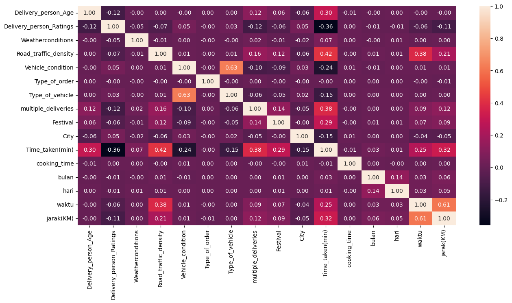
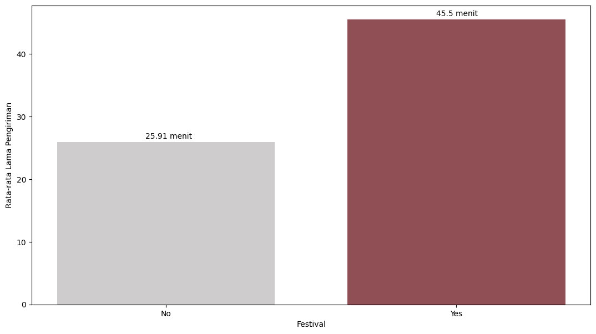

# Food_Delivery
Project ini dibuat sebagai syarat tugas akhir dari bootcamp data science yang saya ikuti dan juga sebagai pembelajaran bagi saya dalam memahami workflow data science. 
<br>

## **Keterangan Data**
Data [delivery_train.csv](/delivery_train.csv) saya ambil dari Kaggle dan pada data tersebut terdapat 20 kolom dengan 45593 baris serta missing value disini ditulis sebagai `NaN`.

Berikut adalah penjelasan untuk setiap feature atau kolom pada data ini:

| Kolom | Deskripsi |
|:--- | :--- |
| ID                         | nomor order
| Delivery_person_ID         | nomor ID driver
| Delivery_person_Age        | usia driver
| Delivery_person_Ratings    | rating yang diberikan oleh customer
| Restaurant_latitude        | latitude restoran
| Restaurant_longitude       | longitude restoran
| Delivery_location_latitude | latitude customer
| Delivery_location_longitude| longitude customer
| Order_Date                 | tanggal order
| Time_Orderd                | waktu customer melakukan order
| Time_Order_picked          | waktu saat driver mengambil makanan
| Weatherconditions          | kondisi cuaca
| Road_traffic_density       | kondisi kepadatan jalan
| Vehicle_condition          | kondisi kendaraan
| Type_of_order              | jenis/tipe makanan yang diorder
| Type_of_vehicle            | jenis kendaraan yang dipakai driver
| multiple_deliveries        | berapa banyak pesanan yang diambil driver
| Festival                   | festival
| City                       | jenis kota (metropolitan, urban atau semi-urban)
| Time_taken(min)            | lama waktu pengantaran
<br>

## **Missing Value Handling**
Pada Data ini Missing Value ditulis sebagai string `NaN`, sehingga tidak akan muncul jika kita menggunakan fungsi `.isna` pada package pandas. Untuk itu kita harus menseleksinya menggunakan cara berikut:

```Python
# data numerik
df_age = df[df['Delivery_person_Age']=='NaN '] 
df_rating = df[df['Delivery_person_Ratings']=='NaN '] 
df_multi = df[df['multiple_deliveries']=='NaN '] 

# data kategorik
df_festival = df[df['Festival']=='NaN '] 
df_weather = df[df['Weatherconditions']=='conditions NaN'] 
df_traffic = df[df['Road_traffic_density']=='NaN ']  
df_city = df[df['City']=='NaN '] 
```
<br>

Untuk data Kategorik kita dapat mengisi missing value menggunakan mode/modus, sedangkan pada data numerik saya mengisinya menggunakan median. 

Pada kolom longitude dan latitude tidak ada missing value sehingga kita dapat mengisi missing value pada kolom city dengan melakukan request menggunakan Google Maps API menggunakan fungsi brikut:

```Python
import requests

def get_city(latitude: float, longitude: float):
    API_KEY = "xxx_API_google_geocode_xxx"
    URL = f"https://maps.googleapis.com/maps/api/geocode/json?latlng={latitude},{longitude}&key={API_KEY}"
    
    response = requests.get(URL)
    data = response.json()
    
    if data['status'] == 'OK':
        for result in data['results']:
            if 'locality' in result['types']:
                return result['address_components'][0]['long_name']
    
    return 'NaN '
```
<br>

Lalu looping value pada kolom `Restaurant_latitude` & `Restaurant_longitude` untuk mendapatkan nama-nama kota berdasarkan longitude dan latitude tersebut.

```Python
kota = []
for x,(y,z) in enumerate(df_city[['Restaurant_latitude','Restaurant_longitude']].values):
    city = get_city(y, z)
    kota.append(city)
```
<br>

Setelah melakukan looping kita buat dataframe baru yang berisi index dan nama-nama kota dari missing value tadi.

```Python
dict_kota = {'index':df_city.index,
    'Restaurant_latitude':df_city['Restaurant_latitude'],
    'Restaurant_longitude':df_city['Restaurant_longitude'],
    'kota' : kota}
acc = pd.DataFrame(dict_kota)
acc.set_index('index')
```
<br>

Lalu kita klasifikasikan nama-nama kota yang sudah kita dapat tersebut sesuai dengan kategorinya yakni Metropolitan, Urban, Semi-Urban. Dari hasil penarikan data menggunakan API google maps tadi masih ada sekitar 100 data yang tidak diketahui, maka 100 data tersebut akan saya masukkan sebagai Metropolitan karena Metropolitan merupakan modus atau nilai yang paling banyak muncul pada kolom city.

```Python
# clasification city
target_metro = ['Mumbai', 'Bengaluru', 'Chennai', 'Hyderabad', 'Kolkata','Pune', 'Secunderabad', 'Ahmedabad', 'Indore']

target_urban = ['Jaipur', 'Ludhiana', 'Coimbatore', 'Mysuru', 'Vadodara', 'Surat', 'Ernakulam', 'Aurangabad', 'Prayagraj', 'Kanpur', 'Dehradun', 'Bhopal','Agra', 'Kochi', 'Thane', 'Panaji']

target_semi = ['Ranchi', 'Kurichi', 'Pimpri-Chinchwad', 'Laxmipura', 'Nataniwala', 'Kothaguda', 'Nanakaramguda', 'Kakkanad', 'Nerul', 'Rundh', 'Mobor Beach', 'Dumardaga', 'Baga', 'Candolim', 'Arpora', 'Calangute', 'Betalbatim', 'Anjuna', 'Laxmipura at Nataniwala', 'Nataniwala']

# replace city name
acc[acc['kota'].isin(target_metro)] = 'Metropolitian '
acc[acc['kota'].isin(target_urban)] = 'Urban '
acc[acc['kota'].isin(target_semi)] = 'Semi-Urban '
acc[acc['kota'] == 'Nan '] = 'Metropolitian '

# replace missing value
df.loc[df_city.index, 'City'] = acc['kota']
```
<br>

Sedangkan missing value pada kolom `Time_Orderd` akan di drop, jumlah missing value pada kolom ini juga sedikit sehingga datanya tidak akan terlalu berpengaruh.
<br>

## **Analisis**
Disini saya menambahkan kolom baru yakni lama waktu penyajian dengan nama kolom `cooking_time`. kolom `cooking_time` merupakan hasil pengurangan dari value kolom `Time_Order_picked` (waktu driver mengambil makanan) dan `Time_Orderd` (waktu customer melakukan order).

Saya juga menambahkan kolom bulan dan hari untuk mengetahui pada bulan dan hari apa jumlah orderan terbanyak dan yang paling sedikit. Serta saya juga melakukan pengelompokan waktu menjadi pagi, siang, sore, dan malam untuk mengetahui pada saat kapan customer paling banyak melakukan pemesanan makanan

Selain itu saya juga menambahkan kolom `jarak(KM)` untuk mengukur jarak antara lokasi customer dan restoran.
<br>

### Outliers
Dari kolom `Delivery_person_Age`, `Delivery_person_Ratings`, `Time_taken(min)`, `cooking_time` dan `jarak(KM)` pada kolom `jarak(KM)` terdapat outliers yang tidak masuk akal seperti yang dapat dilihat pada gambar dibawah ini 

<p align="center">
  
  <em>boxplot dengan outliers</em>
</p>

<p align="center">
  
  <em>boxplot setelah drop outliers</em>
</p>

### Ploting
Pada pengelompokan order berdasarkan bulan, diketahui bahwa pada bulan maret merupakan bulan dengan jumlah order tertinggi dengan 20711 order. Sedangkan yang terendah terjadi pada bulan agustus dengan 923 order saja.

<p align="center">
    
    <em>jumlah order berdasarkan bulan</em>
</p>

Berdasarkan pengelompokan order perharinya, hari dengan jumlah order terbanyak terjadi di hari kamis dengan total 7210 order dan yang paling sedikit terjadi di hari selasa dengan 5176 order.

<p align="center">
  
  <em>jumlah order berdasarkan hari</em>
</p>

Sedangkan pada pengelompokan jumlah order berdasarkan waktu (pagi, siang, sore, malam), diketahui bahwa customer lebih banyak melakukan order pada malam hari dengan jumlah 26886 orderan. Sedangkan yang paling sedikit terjadi pada pagi hari yakni sejumlah 4388 orderan saja.

<p align="center">
    
    <em>jumlah order berdasarkan waktu</em>
</p>


### Multivariat Analisis
<p align="center">
    
    <em>heatmap multivariat analisis</em>
</p>

Dari tabel diatas diketahui ada beberapa faktor yang dapat mempengaruhi lamanya waktu delivery adalah:

1. **Usia driver**, ada korelasi sebesar 0.3 yang menunjukkan bahwa semakin tua usia driver maka waktu delivery juga akan cenderung lama.
<p align="center">
    
    <em>korelasi antara usia driver terhadap lama waktu pengantaran</em>
</p>

2. **Kepadatan lalu lintas**, semakin padat lalu lintas yang dilalui oleh driver akan semakin lama pula waktu deliverynya hal ini ditunjukkan dengan nilai korelasi sebesar 0.38.
<p align="center">
    
    <em>korelasi antara kepadatan lalu lintas terhadap lama waktu pengantaran</em>
</p>

3. **Kondisi kendaraan**, semakin prima kondisi kendaraan driver maka semakin cepat pula waktu deliverinya hal ini ditunjukkan dengan nilai korelasi sebesar -0.24.
<p align="center">
    
    <em>korelasi antara kondisi kendaraan terhadap lama waktu pengantaran</em>
</p>

4. **Banyaknya order**, jika driver mengambil order lebih dari 1 secara bersamaan maka semakin lama juga waktu deliverynya yakni dengan nilai korelasi 0.38.
<p align="center">
    
    <em>korelasi antara banyaknya order terhadap lama waktu pengantaran</em>
</p>

5. **Festival atau event**, jika terdapat festival/event yang diadakan oleh restoran tersebut maka akan cenderung meningkatkan lamanya delivery hal ini ditunjukkan dengan nilai korelasi 0.29.
<p align="center">
    
    <em>korelasi antara adanya festival dan lama waktu pengantaran</em>
</p>

6. **Waktu order**, terdapat korelasi sebesar 0.25 yang berarti semakin petang/malam customer melakukan order maka akan lama pula waktu yang dibutuhkan untuk mengantar pesanan.
<p align="center">
    
    <em>korelasi antara waktu order terhadap lama waktu pengantaran</em>
</p>

Ada pula driver yang menggunakan scooter electrik memiliki kondisi kendaraan yang lebih prima yang mana faktor ini sekaligus dapat memperlancar delivery.

Selain itu, saat petang/malam hari cenderung terjadi kepadatan lalu lintas, dan pada malam hari juga customer cenderung memilih restoran yang jaraknya lebih jauh, mengingat bahwa malam hari juga adalah waktu dimana paling banyak customer melakukan order.

## **Machine Learning Model**
Ada 4 model machine learning yang diuji pada project ini yakni linear regresi, ridge regresi, random forest, dan xg-boost.